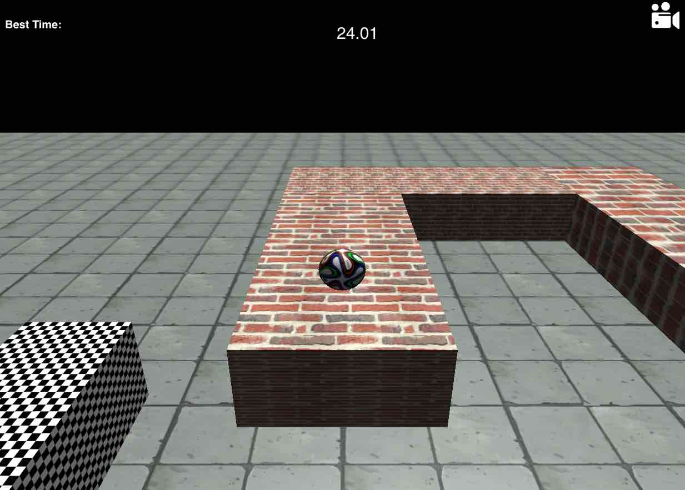

# SMB

[SMB live][git]

[git]: https://mikqmas.github.io/smb/

Super Maze Ball is a 3D Javascript game created with THREE.js and Cannon.js. A showpiece for Javascript V8, HTML5 and WebGL. This is a solo proof of concept created in two days.

## Features & Implementation

The 3D world is created and given basic physics. Once the world and objects are create, the rendering sets the 'scene', 'camera', 'lighting', and skins the 'objects'. Javascript execute the instructions while the browser renders the scene using window.requestAnimationFrame.

Time is calculated using performance.now() that returns microsecond precision.

Best Time/Score is held in a variable and not a backend database, thus is not persistent beyond one session. This could be easily remedied by hosting on Heroku with a PSQL database with some light backend code. 

## Future Directions for the Project

This is a proof of concept. More levels, obstacles, collectable objects, and varied terrains could be added in the future.

Create a database that holds user information and high score board.
